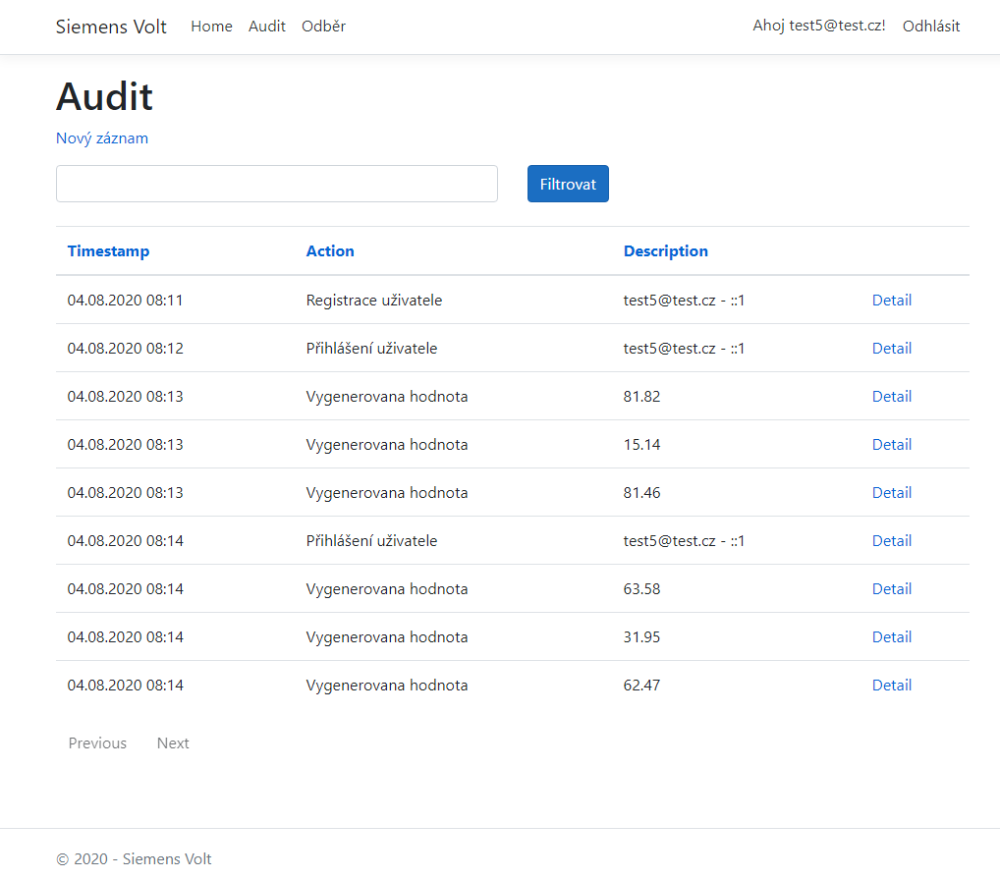
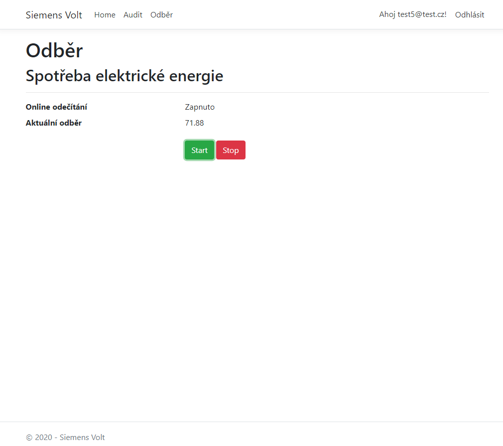
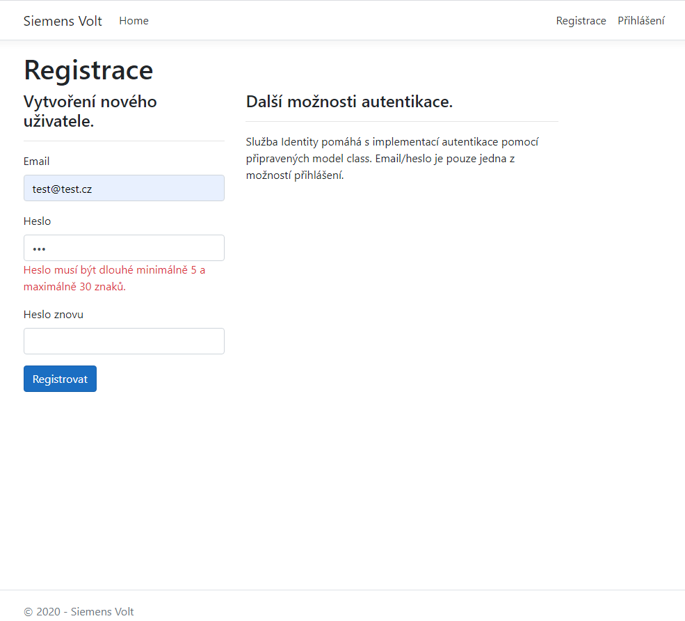
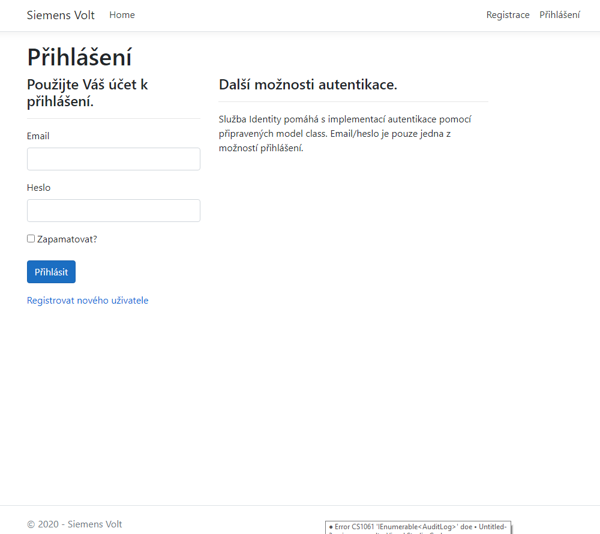

# Siemens Volt

- prezentace dovedností v prostředí ASP.NET, jazyce C# a JS
- aplikace generuje data o spotřebě elektrické energie pomocí JS skriptu
- data jsou ukládána v SQL server databázi
- obsluhující stránky jsou dostupné pouze přihlášeným uživatelům
- logovány jsou akce generování, přihlášení, login

## Příprava prostředí

Pro jednoduché otestování doporučuji použít lokální IIS a SQL server Express. Během konfigurace IIS vytvořit nový application pool, novou webovou aplikaci s vlastním adresářem pro deploy z Visual Studia. V SQL serveru je potřeba vytvořit novou DB a aplikovat přiložený init_db.sql skript.

Connection string je definovaný v appsettings.json. Proveďte prosím jeho úpravu podle Vašeho SQL serveru a DB:
"SqlDbConnection": "Server=<název_server>;Database=<název_db>;Trusted_Connection=True"

## Nasazení aplikace

Ve Visual Studiu zvolit Publish do adresáře. Target location je místo na disku, kde IIS webová aplikace očekává zkompilovaný kód. Configuration Release. Provést Publish. V tuto chvíli se zkompilovaná aplikace nachází na tzv. Physical Path; typicky: C:\inetpub\wwwroot\<název_web_aplikace>.

Při nastavení Pool Identity na ApplicationPoolIdentity bude do databáze přistupovat vlastník procesu. Přístup do DB tedy musí mít uživatel 'IIS APPPOOL\<název_web_aplikace>'. Aplikace je ošetřena proti podobným chybám. Pro případné ladění povolte ExceptionPage a ErrorPage v Startup.cs - metodě Configure().

## Testování

Aplikace naběhne na veřejném View. Přejděte prosím k registraci, loginu a poté na stránky Audit a Odběr. Audit zobrazuje zalogovaná data z DB s možností detailu, filtrace, sortování a stránkování. Odběr nabízí generování hodnot pomocí JS skriptu.

## Troubleshooting

[Nastavení IIS](https://docs.microsoft.com/en-us/aspnet/core/host-and-deploy/iis/?view=aspnetcore-3.1)

[Publish aplikace do IIS](https://docs.microsoft.com/en-us/aspnet/core/tutorials/publish-to-iis?view=aspnetcore-3.1&tabs=visual-studio)

[Nápomocné video](https://www.youtube.com/watch?v=ZG-6z4BQmRI)

Chyba: "SqlException: Cannot open database "siemens" requested by the login. The login failed. Login failed for user 'IIS APPPOOL\Core310'."

Řešení:
- app pool se prihlasuje do DB pod identitou, pod kterou bezi proces
- do DB se tedy aplikace prihlasuje pod userem: 'IIS APPPOOL\Core310'
  - CLR version: No managed; Mode: Integrated; Identity: AppPoolIdentity
- proto je nutne vytvorit v DB uzivatele 'IIS APPPOOL\Core310' a dat mu prava na DB
  - Windows Auth
  - User Mapping - checkbox: on, user: 'IIS APPPOOL\Core310', schema: 'IIS APPPOOL\Core310'

## Screenshoty

### Audit

- výpis dat z DB
- umožňuje sortování, filtrování a stránkování na straně BE

### Odběr

- spouští/zastavuje generování hodnot z JS skriptu
- data jsou odeslána do kontrolleru k uložení do DB
- k dispozici je status a aktuální hodnota

### Registrace

- registrace vynucuje pomocí validací korektní email, shodná hesla a minimální/maximální délku
- úspěšná registrace je zalogována

### Přihlášení

- vstup na akční obsah webu je dostupný pouze přihlášeným uživatelům
- úspěšné přihlášení je zalogováno

